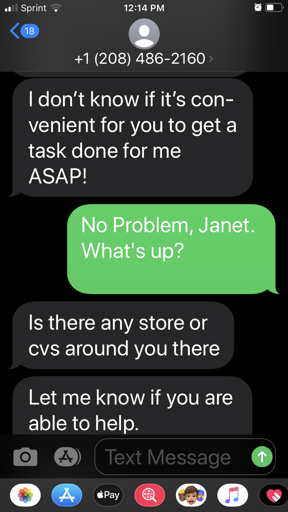
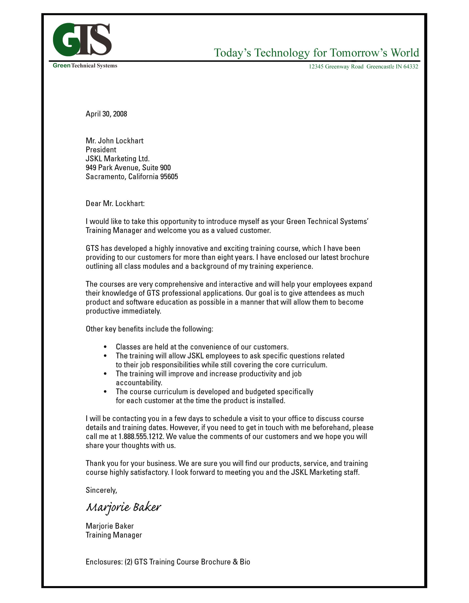
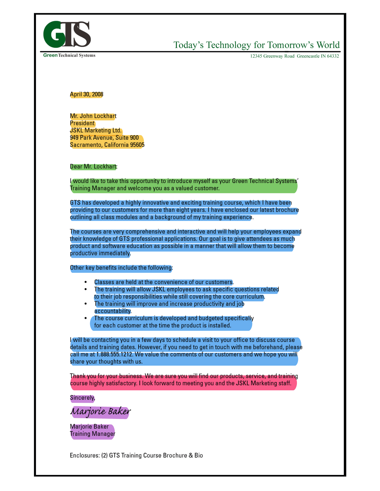
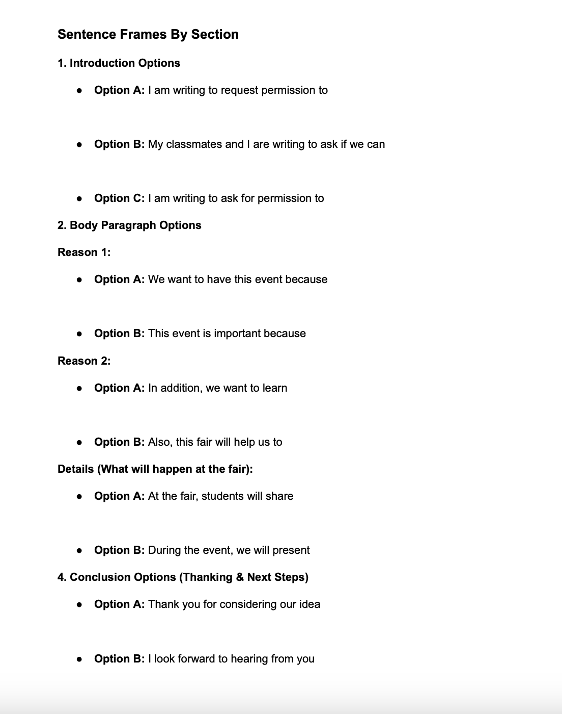
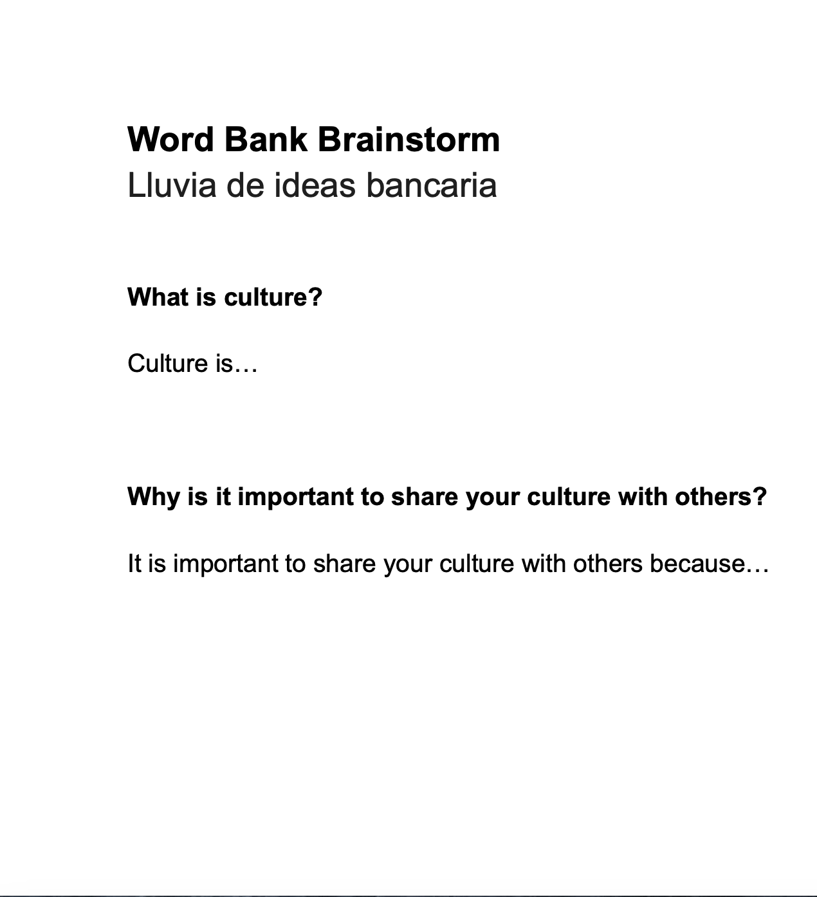

# Lesson Sequence
**Jump to:** [Day 1](#day-1-recognizing-the-5-parts-of-a-business-letter) | [Day 2](#day-2-using-sentence-frames-and-creating-a-word-bank) | [Day 3](#day-3-plan-and-write-a-request-letter)

### **Who This Lesson Is For:** Teachers of Level 1 and 2 EML students

#### **Objective:** #### 
By the end of this unit, students will be able to identify the 5 parts of a business letter and draft a short, correctly formatted letter for a realistic purpose–hosting a cultural fair at their school.

**Before you begin:**

| Students can... | 30-Second Check | If Not |
| --- | --- | ---- |
| Write their name and home address in English | Ask each student to write both on an index card or sticky note. | Let the student copy from an ID or a partner's model. Practice during the Day 1 warm-up. |
| Copy a short English sentence accurately. | Write "I am a student." on the board. Ask students to copy it on a blank sheet of paper. | Give the student extra time on Day 2. Pair the student with a partner for the fill-in letter. |
| Use a Spanish–English dictionary. | Ask each student to look up permission in the dictionary. | Model using the dictionary during the Day 1 warm-up. | 

**Note:** Students do not need to know the parts of a letter, formal vocabulary, or specific U.S. date and address conventions before starting this unit. 

### **What You Need:**
- Five highlighter colors per student pair: yellow, green, blue, pink, and purple
- Spanish–English dictionaries (students may use them at any time)
- About 90 minutes of total prep across the unit (details on each day)

### **Word wall (15 minutes)**

- Write these eight words on a wall, one per card: *sender, recipient, heading, salutation, body, closing, signature, formal.* 

- Draw or paste one simple picture next to each word. 

- Leave the wall up for the whole unit.

You can write them on a chalkboard or post them on sticky notes. Each word should be accompanied by a single, simple picture. Day 1 teaches formal through comparing and contrasting. Day 2 teaches the remaining seven definitions.

## Day 1: Recognizing the 5 Parts of a Business Letter

### **Objective:**  
Students will be able to identify the five parts of a business letter on a sample. 

**Prep time:** ~20 minutes 

**Print:** 
Text Message Sample (1 copy)

Business Letter Sample (1 per student)

Highlighted Business Letter (1 per pair)

### **Warm-up** (15 min)
1. Place the text message and Business Letter Sample side by side on the board.
2. Ask students, "Which one is more formal?"
3. Ask students to point to one.
4. Say "Formal language is clear, respectful, and serious. We use it with important people or figures of authority."
5. Write three headings on the board: Purpose, Audience, Message.
6. Ask students to identify the purpose, audience, and message of both the text message and Business Letter Sample.

### **Direct Instruction** (15 min)
1. Point to the heading of the Business Letter Sample and say, "I notice this letter starts with an address and a date."
2. Repeat for the salutation, body, closing, and signature.
3. Ask students to point to the same part on their own copies.
4. Ask students to repeat each sentence after you. For example, “I notice that they signed their name at the end of this letter.”

### **Guided Practice** (15 min)
1. Pair students. Make groups of three if the class has an odd number of students.
2. Distribute Business Letter Sample and one set of five highlighters per pair.
3. Ask students to highlight each of the 5 parts of a business letter using the color key.
4. Circulate. Ask each pair, "Where is the heading?... Where is the body?…"

### **Wrap-up** (15 min)
1. Call out a part name.
2. Ask students to point to that part on their sample letter. Repeat for all five parts (10 min).
3. Read each part name aloud and ask students to repeat it (5 min).

**Expected result:** At least 80% of students can point to at least 4 of the 5 parts when you name them.

### **Materials For Day 1:**

### Text Message Sample
This is an informal example for contrast — students should recognize this as *not* the tone or format their letter should have, and be able to say why. 

### Business Letter Sample
This is a formal example of a business letter. This is an unmarked version that students will highlight during Guided Practice. It maps out the 5 parts of a business letter defined in the Overview:

- **Heading** — sender's name, address, and date, followed by the recipient's name and address
- **Salutation** — greets the recipient and states the purpose
- **Body** — explains the request in detail
- **Closing** — thanks the reader and states next steps
- **Signature** — formal sign-off and sender's name

### Highlighted Business Letter Key
This document is the answer key for the Guided Practice. Use it to check pairs' highlighting as your circulate. Each color corresponds to one of the 5 parts above:

* **Yellow:** Heading
* **Green:** Salutation
* **Blue:** Body
* **Pink:** Closing
* **Purple:** Signature

## **Day 2: Using Sentence Frames and Creating a Word Bank**

### Objective: 
Students will be able to complete a fill-in-the-blank business letter using sentence frames and a word bank brainstorm sheet. 

**Prep Time:** ~20 minutes

**Print:**
Fill-in-the-blank Letter (1 per student)
Sentence Frames and Word Bank Brainstorm Sheet (1 per pair)

### **Warm-up** (15 min)
1. Distribute a set of word cards containing the 7 letter part terms *sender, recipient, heading, salutation, body, closing, and signature*, with picture cards to each pair.
2. Ask pairs to match each word to its picture.
3. Display the definitions on the board next to the pictures.
4. Read each word in English, then in Spanish.

### **Direct instruction** (15 min)
1. Distribute the fill-in-the-blank letters, sentence frames and word bank brainstorm sheet.
2. Read the first frame aloud. Ask students to find it in their letter.
3. Repeat for each part of the letter.
4. Circle the word I in every sentence. Say, "In English, our letter needs an I."
5. Point to because. Say, "Because gives our reason."
6. Point to the date. Say, "Month, Day, Year."

### **Guided practice** (15 min)
1. Pair students. If an uneven number, make groups of three.
2. Ask pairs to fill in each blank using the word bank and sentence frames.
3. Circulate. Check that each sentence starts with I or a clear subject.

### **Wrap-up** (15 min)
1. Ask, “What is culture?”  Give examples: food, traditions, clothes. Then ask, “Why is it important to share your culture with others?”
2. Explain what a cultural fair is, using photos or drawings.
3. Write student’s answers on the board, creating a word bank for day 3.

**Expected result:** Every blank is filled, every sentence has a clear subject, and the date is written Month Day, Year.

### **Materials For Day 2:**

### Sentence Frames by Section

Use this sheet to help students construct full sentences during the planning and writing phase. 

### Word Bank Brainstorm

Use the Word Bank Brainstorm to generate vocabulary and ideas for your letters. You can write your word bank on your chalkboard, or paper if you prefer. 

**Note:** This sheet is meant to help generate ideas for a word bank. It is a planning tool used to create a class word bank, rather than an independent worksheet. 

### Fill-in-the-blank-letter

Use this template to help students practice proper letter layout, key vocabulary, and sentence mechanics.

## **Day 3: Plan and Write a Request Letter**

### **Objective:**
 Students will be able to draft, review, and share an original business letter proposing a cultural fair for their school.
 
**Prep time:** ~ 15 minutes 

**Print:** 
Student Checklist (1 per student)
 Have lined paper ready.

### **Warm-up** (15 min)
1. Read each Student Checklist item aloud.
2. Ask students to show thumbs up (I understand) or thumbs down (I do not).
3. Ask, "Why is it important to share our cultures?"
4. Accept answers in Spanish. Restate each in English and write it on the board.
5. Write Dear [principal name], on the board. 
6. Write the first body paragraph sentence together, using the frame, “I am writing to request permission to…”

### **Drafting** (25 min)
1. Pass out lined papers for students to draft letters.
2. Ask students to write their letter using their sentence frames and word bank.
3. Circulate. Assist students with any translations.
4. Remind students that using dictionaries is allowed.

### **Peer check** (10 min)
1. Ask partners to trade letters.
2. Ask each partner to check each Student Checklist item.
3. Ask each partner to name one thing to fix.
4. Ask students to revise their letters according to peer feedback.

### **Read-aloud** (10 min)
1. Ask each student to read the letter (or one paragraph) to a partner or the class.
2. Collect the letters.

### **Expected result:**
 Each letter has all five parts and at least one original detail. 

--- 

### [← Previous: Overview](overview.md) | [Next: Troubleshooting →](troubleshooting.md)

